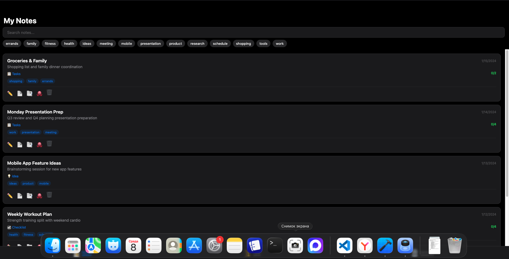

# AI Notes

AI-powered assistant for quick note-taking and thought structuring.

Capture ideas by voice or text — AI transforms them into tasks, key points, questions, and plans.


## Demo

### Creating a Note

1. Open the **New** tab
2. Type or dictate your thoughts
3. Tap **Structure** — AI will organize your text
4. Review and edit the result
5. Tap **Save**

### Example Input

```
Need to buy groceries: milk, bread, eggs. Call mom about Sunday dinner.
Prepare presentation for Monday meeting — include Q3 results.
Research new project management tools, deadline is Friday.
```

### AI-Structured Output

**Title:** Groceries & Tasks

**Tasks:**
- 🔴 Buy groceries (milk, bread, eggs)
- 🔴 Prepare Q3 presentation for Monday
- 🟡 Research project management tools

**Key Points:**
- Call mom about Sunday dinner
- Deadline for PM tools research is Friday

**Tags:** `shopping` `work` `family`

### Voice Input

1. Tap the **🎤 Voice** button
2. Speak your thoughts clearly
3. Tap **⏹ Stop** when done
4. Review the transcribed text
5. Tap **Structure** to organize

### Filtering Notes

1. Use the **search bar** to find notes by text
2. Tap **tags** to filter by category
3. Select multiple tags for AND filtering
4. Tap **Clear** to reset filters

### Editing Notes

1. Find the note you want to edit
2. Tap the **✏️** icon
3. Modify the text or structure
4. Tap **Restructure** to re-analyze with AI
5. Tap **Save** to update

### Dark Mode

1. Go to **Settings**
2. Tap **Appearance**
3. Choose:
   - **Auto** — follows system settings
   - **Light** — always light theme
   - **Dark** — always dark theme

### Export Options

For each note, you can:
- **📄 Markdown** — export as .md file
- **📑 PDF** — export as PDF document
- **🐙 GitHub** — copy as GitHub Issue format

## Quick Start

```bash
# Install dependencies
npm install

# Run web version
npm run web

# Or run on iOS (requires development build)
npx expo run:ios
```

## Features

| Feature | Description |
|---------|-------------|
| 🎤 Voice Input | Dictate notes with speech-to-text |
| ✨ AI Structuring | Automatic task/key point extraction |
| 🏷️ Smart Tags | Auto-generated relevant tags |
| 🔍 Search & Filter | Full-text search + tag filtering |
| ✏️ Edit Notes | Modify content and re-analyze |
| 🌙 Dark Mode | Light, dark, and system themes |
| 📱 Cross-Platform | iOS, Android, and Web |
| 🔌 Offline Mode | Works without internet (basic structuring) |
| ☁️ Cloud Sync | Sync notes across devices (Firebase) |

## Tech Stack

| Layer | Technology |
|-------|-----------|
| Frontend | React Native (Expo SDK 52) |
| Language | TypeScript |
| AI | DeepSeek API |
| Backend | Firebase (Firestore + Auth) |
| Storage | AsyncStorage (local) |
| Speech | expo-speech-recognition |

## Configuration

### DeepSeek API

1. Get an API key at [platform.deepseek.com](https://platform.deepseek.com)
2. Create a `.env` file:
   ```
   EXPO_PUBLIC_DEEPSEEK_API_KEY=sk-your-key-here
   ```
3. Or enter the key in Settings → DeepSeek API

### Firebase (Optional)

For cloud sync between devices:

1. Create a project at [Firebase Console](https://console.firebase.google.com)
2. Enable **Authentication** (Email/Password)
3. Create a **Firestore Database**
4. Add your Firebase config to `.env`:
   ```
   EXPO_PUBLIC_FIREBASE_API_KEY=...
   EXPO_PUBLIC_FIREBASE_AUTH_DOMAIN=...
   EXPO_PUBLIC_FIREBASE_PROJECT_ID=...
   EXPO_PUBLIC_FIREBASE_STORAGE_BUCKET=...
   EXPO_PUBLIC_FIREBASE_MESSAGING_SENDER_ID=...
   EXPO_PUBLIC_FIREBASE_APP_ID=...
   ```
5. Add `GoogleService-Info.plist` (iOS) to project root

## Project Structure

```
src/
├── screens/           # App screens
│   ├── NewNoteScreen.tsx      # Create notes
│   ├── NotesListScreen.tsx    # View & filter notes
│   ├── EditNoteScreen.tsx     # Edit notes
│   ├── SettingsScreen.tsx     # App settings
│   ├── AuthScreen.tsx         # Login (iOS/Android)
│   └── AuthScreenWeb.tsx      # Login (Web)
├── services/          # Business logic
│   ├── deepseek.ts    # AI integration
│   ├── offline.ts     # Offline fallback
│   ├── storage.ts     # Local storage
│   ├── sync.ts        # Firebase sync
│   ├── firebase-web.ts # Web auth
│   ├── speech.ts      # Voice input
│   └── export.ts      # Export to MD/PDF
├── config/            # Configuration
│   ├── index.ts       # API endpoints
│   ├── theme.ts       # Color themes
│   └── ThemeContext.tsx # Theme provider
└── types/             # TypeScript types
```

## Tips for Effective Use

1. **Be specific** in your notes — AI works better with clear context
2. **Use voice input** for longer thoughts — it's faster than typing
3. **Review AI output** — you can edit tasks and key points
4. **Tag consistently** — helps with organization and filtering
5. **Export important notes** — keep backups as Markdown or PDF
6. **Use offline mode** — notes are saved locally even without internet

## Screenshot

@SEE screenshot.png

## License

MIT
